# Hotel Management System
## Business Process & Use Case Documentation

---

## 1. System Overview

The Hotel Management System (HMS) is a comprehensive database application designed to manage all aspects of hotel operations including reservations, guest services, payments, housekeeping, and maintenance.

---

## 2. System Actors (Agents)

### Actor Hierarchy Diagram

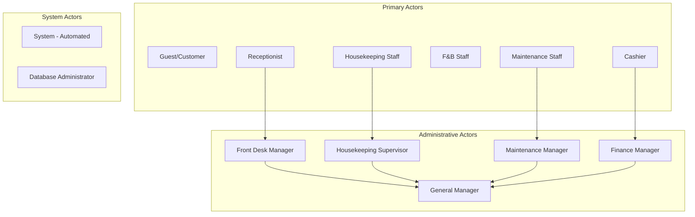

### 2.1 Primary Actors

| Actor | Role | Description |
|-------|------|-------------|
| **Guest/Customer** | End User | Hotel guests who make reservations, use services, and provide feedback |
| **Receptionist** | Front Desk Staff | Handles check-in/check-out, reservations, and guest inquiries |
| **Housekeeping Staff** | Room Attendant | Manages room cleaning and maintenance status |
| **F&B Staff** | Food & Beverage | Handles room service and restaurant orders |
| **Maintenance Staff** | Technician | Handles room repairs and maintenance requests |
| **Cashier** | Payment Handler | Processes payments and issues invoices |

### 2.2 Administrative Actors

| Actor | Role | Description |
|-------|------|-------------|
| **Front Desk Manager** | Supervisor | Oversees front desk operations, handles escalations |
| **Housekeeping Supervisor** | Supervisor | Manages housekeeping schedules and room assignments |
| **Maintenance Manager** | Supervisor | Assigns and monitors maintenance tasks |
| **Finance Manager** | Accounting | Monitors revenue, payments, and financial reports |
| **General Manager** | Administrator | Full system access, strategic decisions |

---

## 3. Business Processes

### 3.1 Reservation Management Process

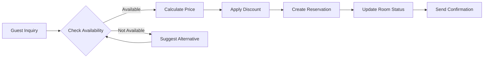

**Process Steps:**
1. Guest inquires about room availability
2. Receptionist checks room availability for desired dates
3. System calculates room price (with seasonal/weekend rates)
4. System applies customer discount (based on membership tier)
5. Receptionist creates reservation
6. System confirms reservation and updates room status
7. System sends confirmation notification

**Database Objects Used:**
- `sp_create_reservation` - Creates reservation with validation
- `fn_check_room_availability` - Checks room availability
- `fn_calculate_room_price` - Calculates dynamic pricing
- `fn_calculate_discount_rate` - Applies membership discounts
- `vw_room_availability` - Shows available rooms

---

### 3.2 Check-In Process

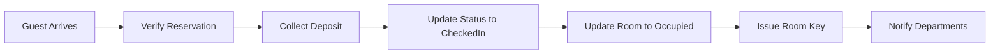

**Process Steps:**
1. Guest arrives at front desk
2. Receptionist verifies reservation details
3. Receptionist collects deposit/payment
4. System updates reservation status to "CheckedIn"
5. System updates room status to "Occupied"
6. System triggers notification to relevant departments
7. Receptionist issues room key to guest

**Database Objects Used:**
- `trg_reservation_status_change` - Updates room status automatically
- `sp_process_payment` - Processes deposit
- `trg_reservation_audit` - Logs check-in event

---

### 3.3 Check-Out Process

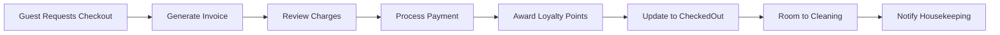

**Process Steps:**
1. Guest requests check-out
2. System generates detailed invoice with all charges
3. Guest reviews charges (room + services)
4. Cashier processes final payment
5. System awards loyalty points
6. System updates reservation to "CheckedOut"
7. System updates room to "Cleaning"
8. System notifies housekeeping

**Database Objects Used:**
- `sp_generate_invoice` - Generates detailed invoice
- `fn_calculate_total_bill` - Calculates total charges
- `sp_process_payment` - Processes payment
- `fn_calculate_loyalty_points` - Awards points
- `trg_reservation_status_change` - Updates room status

---

### 3.4 Service Request Process

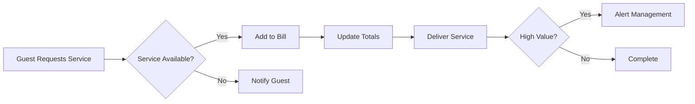

**Database Objects Used:**
- `sp_add_service_to_reservation` - Adds service to bill
- `trg_service_usage_notification` - Alerts for high-value services
- `vw_popular_services` - Analytics on service usage

---

### 3.5 Payment Process

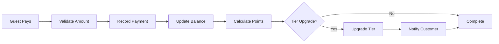

**Database Objects Used:**
- `sp_process_payment` - Processes payment
- `fn_calculate_loyalty_points` - Calculates points
- `trg_payment_loyalty_update` - Handles tier upgrades
- `trg_payment_audit` - Logs payment

---

### 3.6 Reservation Cancellation Process

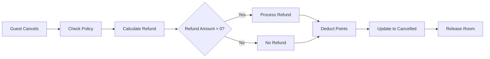

**Cancellation Policy:**
| Days Before Check-In | Refund Percentage |
|---------------------|-------------------|
| More than 7 days | 100% |
| 3-7 days | 75% |
| 1-2 days | 50% |
| Same day | 25% |
| After check-in | 0% |

**Database Objects Used:**
- `sp_cancel_reservation` - Handles cancellation
- `trg_reservation_status_change` - Updates room status

---

### 3.7 Housekeeping Process

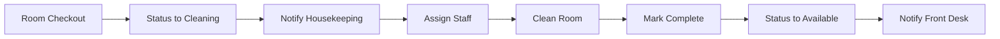

**Database Objects Used:**
- `trg_room_status_history` - Logs status changes
- `vw_room_availability` - Shows room status
- `fn_calculate_room_turnaround_time` - Tracks cleaning efficiency

---

### 3.8 Maintenance Process

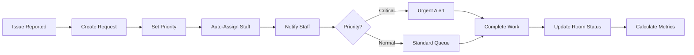

**Database Objects Used:**
- `sp_create_maintenance_request` - Creates request
- `sp_complete_maintenance` - Completes request
- `trg_high_priority_maintenance` - Urgent alerts
- `vw_maintenance_dashboard` - SLA tracking
- `fn_get_available_staff` - Staff availability

---

### 3.9 Customer Registration Process

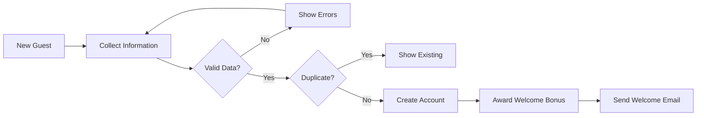

**Database Objects Used:**
- `sp_register_customer` - Registers customer
- `vw_customer_history` - Customer profile

---

### 3.10 Loyalty Program Process

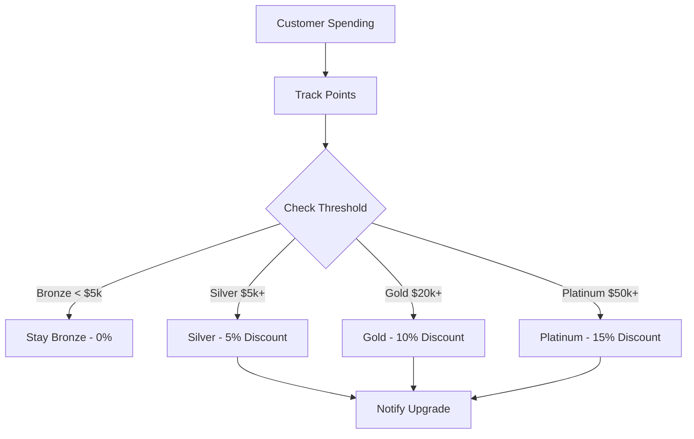

**Loyalty Tiers:**
| Tier | Spending Threshold | Discount | Benefits |
|------|-------------------|----------|----------|
| Bronze | $0+ | 0% | Basic membership |
| Silver | $5,000+ | 5% | Priority check-in |
| Gold | $20,000+ | 10% | Free upgrades, late checkout |
| Platinum | $50,000+ | 15% | VIP lounge, free breakfast |

---

## 4. Use Case Diagram

```mermaid
graph TB
    subgraph "Hotel Management System"
        subgraph "Reservation Module"
            UC1[Make Reservation]
            UC2[Cancel Reservation]
            UC3[Check-In]
            UC4[Check-Out]
            UC5[Check Availability]
        end
        
        subgraph "Payment Module"
            UC6[Process Payment]
            UC7[Generate Invoice]
            UC8[Process Refund]
            UC9[View Balance]
        end
        
        subgraph "Service Module"
            UC10[Request Service]
            UC11[Add Service to Bill]
            UC12[View Menu]
        end
        
        subgraph "Operations Module"
            UC13[Create Maintenance]
            UC14[Complete Maintenance]
            UC15[Clean Room]
            UC16[Update Room Status]
        end
        
        subgraph "Customer Module"
            UC17[Register Customer]
            UC18[View History]
            UC19[Submit Review]
            UC20[View Loyalty Status]
        end
        
        subgraph "Reporting Module"
            UC21[View Occupancy Report]
            UC22[View Revenue Report]
            UC23[View Performance]
            UC24[View Dashboard]
        end
    end
    
    Guest((Guest)) --> UC1
    Guest --> UC2
    Guest --> UC10
    Guest --> UC19
    Guest --> UC20
    
    Receptionist((Receptionist)) --> UC1
    Receptionist --> UC3
    Receptionist --> UC4
    Receptionist --> UC5
    Receptionist --> UC17
    
    Cashier((Cashier)) --> UC6
    Cashier --> UC7
    Cashier --> UC8
    
    FBStaff((F&B Staff)) --> UC11
    FBStaff --> UC12
    
    Housekeeping((Housekeeping)) --> UC15
    Housekeeping --> UC16
    
    Maintenance((Maintenance)) --> UC14
    
    Manager((Manager)) --> UC13
    Manager --> UC21
    Manager --> UC22
    Manager --> UC23
    Manager --> UC24
```

---

## 5. Use Cases by Actor

### 5.1 Guest/Customer Use Cases

| UC ID | Use Case | Description | Related DB Objects |
|-------|----------|-------------|-------------------|
| UC-G01 | Make Reservation | Guest books room for specific dates | `sp_create_reservation` |
| UC-G02 | Cancel Reservation | Guest cancels booking and receives refund | `sp_cancel_reservation` |
| UC-G03 | Check-In | Guest arrives and checks into room | `trg_reservation_status_change` |
| UC-G04 | Check-Out | Guest checks out and settles bill | `sp_generate_invoice` |
| UC-G05 | Request Service | Guest orders room service, spa, etc. | `sp_add_service_to_reservation` |
| UC-G06 | Make Payment | Guest pays for stay and services | `sp_process_payment` |
| UC-G07 | View Bill | Guest reviews current charges | `fn_calculate_total_bill` |
| UC-G08 | Submit Review | Guest provides feedback on stay | REVIEWS table |
| UC-G09 | View Loyalty Status | Guest checks points and tier | `vw_customer_history` |
| UC-G10 | Report Issue | Guest reports room maintenance issue | `sp_create_maintenance_request` |

### 5.2 Receptionist Use Cases

| UC ID | Use Case | Description | Related DB Objects |
|-------|----------|-------------|-------------------|
| UC-R01 | Register Customer | Create new customer account | `sp_register_customer` |
| UC-R02 | Search Availability | Check room availability for dates | `vw_room_availability` |
| UC-R03 | Create Reservation | Book room for customer | `sp_create_reservation` |
| UC-R04 | Modify Reservation | Change dates, room, or details | RESERVATIONS table |
| UC-R05 | Cancel Reservation | Cancel booking per customer request | `sp_cancel_reservation` |
| UC-R06 | Process Check-In | Check in arriving guest | `trg_reservation_status_change` |
| UC-R07 | Process Check-Out | Check out departing guest | `sp_generate_invoice` |
| UC-R08 | View Customer History | Review customer's past stays | `vw_customer_history` |
| UC-R09 | Handle Room Change | Transfer guest to different room | RESERVATIONS table |
| UC-R10 | Create Maintenance Request | Report room issues | `sp_create_maintenance_request` |

### 5.3 Cashier Use Cases

| UC ID | Use Case | Description | Related DB Objects |
|-------|----------|-------------|-------------------|
| UC-C01 | Process Payment | Accept and record payment | `sp_process_payment` |
| UC-C02 | Generate Invoice | Create detailed bill for guest | `sp_generate_invoice` |
| UC-C03 | Process Refund | Handle cancellation refunds | `sp_cancel_reservation` |
| UC-C04 | View Outstanding | Check unpaid balances | `vw_outstanding_payments` |
| UC-C05 | Apply Discount | Apply promotional/loyalty discounts | `fn_calculate_discount_rate` |
| UC-C06 | Daily Reconciliation | End-of-day cash reconciliation | `vw_daily_revenue_report` |

### 5.4 Housekeeping Staff Use Cases

| UC ID | Use Case | Description | Related DB Objects |
|-------|----------|-------------|-------------------|
| UC-H01 | View Cleaning Queue | See rooms needing cleaning | `vw_room_availability` |
| UC-H02 | Start Room Cleaning | Begin cleaning assigned room | ROOMS table |
| UC-H03 | Complete Cleaning | Mark room as clean/available | `trg_room_status_history` |
| UC-H04 | Report Issue | Flag maintenance issues found | `sp_create_maintenance_request` |
| UC-H05 | Update Room Status | Change room status | `trg_room_status_history` |
| UC-H06 | View Schedule | Check work shift assignments | EMPLOYEE_SHIFTS table |

### 5.5 Maintenance Staff Use Cases

| UC ID | Use Case | Description | Related DB Objects |
|-------|----------|-------------|-------------------|
| UC-M01 | View Assigned Tasks | See maintenance requests assigned | `vw_maintenance_dashboard` |
| UC-M02 | Start Maintenance | Begin work on request | MAINTENANCE_REQUESTS table |
| UC-M03 | Complete Maintenance | Mark request as finished | `sp_complete_maintenance` |
| UC-M04 | Log Actual Cost | Record actual repair cost | `sp_complete_maintenance` |
| UC-M05 | Update Priority | Escalate/de-escalate urgency | MAINTENANCE_REQUESTS table |
| UC-M06 | View Schedule | Check work shift assignments | EMPLOYEE_SHIFTS table |

### 5.6 Manager Use Cases

| UC ID | Use Case | Description | Related DB Objects |
|-------|----------|-------------|-------------------|
| UC-MG01 | View Occupancy Report | Monitor occupancy rates | `vw_occupancy_statistics` |
| UC-MG02 | View Revenue Report | Analyze daily/monthly revenue | `vw_daily_revenue_report` |
| UC-MG03 | View Outstanding Payments | Monitor unpaid balances | `vw_outstanding_payments` |
| UC-MG04 | View Employee Performance | Review staff metrics | `vw_employee_performance` |
| UC-MG05 | Assign Maintenance | Allocate maintenance tasks | `sp_create_maintenance_request` |
| UC-MG06 | View Maintenance Dashboard | Monitor SLA compliance | `vw_maintenance_dashboard` |
| UC-MG07 | Manage Staff Schedules | Create/modify work shifts | EMPLOYEE_SHIFTS table |
| UC-MG08 | View Customer Analytics | Analyze customer trends | `vw_customer_history` |
| UC-MG09 | View Service Analytics | Monitor service usage trends | `vw_popular_services` |
| UC-MG10 | View Maintenance Stats | Monitor maintenance metrics | `fn_get_maintenance_statistics` |

### 5.7 System (Automated) Use Cases

| UC ID | Use Case | Description | Related DB Objects |
|-------|----------|-------------|-------------------|
| UC-S01 | Auto-Update Room Status | Trigger room status changes | `trg_reservation_status_change` |
| UC-S02 | Award Loyalty Points | Calculate and add points | `trg_payment_loyalty_update` |
| UC-S03 | Upgrade Customer Tier | Auto-upgrade membership | `trg_customer_tier_upgrade` |
| UC-S04 | Send Notifications | Generate system alerts | NOTIFICATIONS table |
| UC-S05 | Log Audit Trail | Record all changes | `trg_reservation_audit`, `trg_payment_audit` |
| UC-S06 | Calculate Dynamic Pricing | Apply seasonal rates | `fn_calculate_room_price` |
| UC-S07 | Auto-Assign Staff | Assign maintenance tasks | `sp_create_maintenance_request` |
| UC-S08 | Track Room History | Log room status changes | `trg_room_status_history` |
| UC-S09 | High Priority Alerts | Create urgent notifications | `trg_high_priority_maintenance` |
| UC-S10 | Service Usage Alerts | Alert for high-value services | `trg_service_usage_notification` |

---

## 6. Entity Relationship Diagram

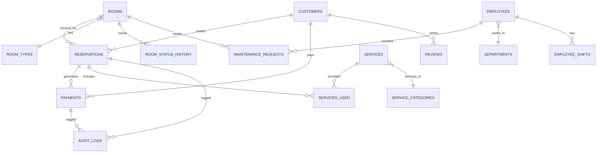

---

## 7. Database Objects Mapping

| Process | Procedures | Views | Triggers | Functions |
|---------|------------|-------|----------|-----------|
| Reservation | `sp_create_reservation`, `sp_cancel_reservation` | `vw_room_availability`, `vw_occupancy_statistics` | `trg_reservation_status_change`, `trg_reservation_audit` | `fn_check_room_availability`, `fn_calculate_room_price` |
| Payment | `sp_process_payment`, `sp_generate_invoice` | `vw_daily_revenue_report`, `vw_outstanding_payments` | `trg_payment_loyalty_update`, `trg_payment_audit` | `fn_calculate_total_bill`, `fn_calculate_loyalty_points` |
| Customer | `sp_register_customer`, `sp_add_service_to_reservation` | `vw_customer_history`, `vw_popular_services` | `trg_customer_tier_upgrade`, `trg_service_usage_notification` | `fn_get_customer_tier`, `fn_get_customer_statistics` |
| Operations | `sp_create_maintenance_request`, `sp_complete_maintenance` | `vw_maintenance_dashboard`, `vw_employee_performance` | `trg_room_status_history`, `trg_high_priority_maintenance` | `fn_calculate_room_turnaround_time`, `fn_get_available_staff` |

---

*Document Version: 1.0*  
*Last Updated: December 2024*
