# Member Business Process Verification

This document verifies that each team member's SQL objects form **multiple complete, comprehensive business processes**. Each process has its own context, actors, workflow, and database objects.

---

# Phuc: Reservation & Room Management

## Business Context
Phuc is responsible for the **Reservation & Room Management** domain. This includes all processes related to booking hotel rooms, managing room availability, handling guest check-ins and check-outs, and processing no-show situations.

---

### Process 1: Room Booking Process

**Context:** A guest wants to book a room at the hotel. This process covers the entire journey from inquiry to confirmed reservation.

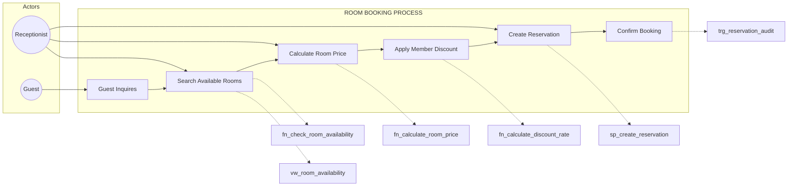

| Step | Actor | Action | Database Object |
|------|-------|--------|-----------------|
| 1 | Guest | Inquires about rooms | - |
| 2 | Receptionist | Searches available rooms | `fn_check_room_availability`, `vw_room_availability` |
| 3 | Receptionist | Calculates room price | `fn_calculate_room_price` |
| 4 | System | Applies membership discount | `fn_calculate_discount_rate` |
| 5 | Receptionist | Creates reservation | `sp_create_reservation` |
| 6 | System | Logs & confirms booking | `trg_reservation_audit` |

---

### Process 2: Guest Check-In Process

**Context:** A guest with a confirmed reservation arrives at the hotel. This process handles the check-in, room allocation, and status updates.

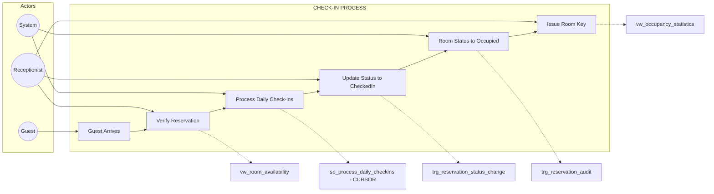

| Step | Actor | Action | Database Object |
|------|-------|--------|-----------------|
| 1 | Guest | Arrives at hotel | - |
| 2 | Receptionist | Verifies reservation | `vw_room_availability` |
| 3 | System | Processes daily check-ins batch | `sp_process_daily_checkins` (CURSOR) |
| 4 | Receptionist | Updates status | `trg_reservation_status_change` |
| 5 | System | Updates room to Occupied | `trg_reservation_audit` |
| 6 | Receptionist | Issues room key | `vw_occupancy_statistics` |

---

### Process 3: Reservation Cancellation & No-Show Process

**Context:** A guest cancels their reservation, or fails to show up. This process handles refunds, penalties, and room release.

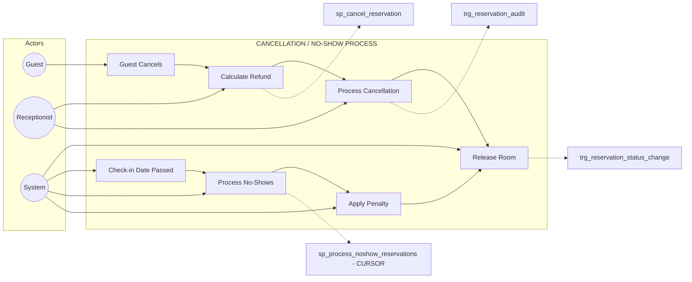

| Step | Actor | Action | Database Object |
|------|-------|--------|-----------------|
| 1 | Guest | Requests cancellation | - |
| 2 | Receptionist | Calculates refund based on policy | `sp_cancel_reservation` |
| 3 | Receptionist | Processes cancellation | `trg_reservation_audit` |
| 4 | System | Releases room back to available | `trg_reservation_status_change` |
| 5 | System | Detects no-show (automated) | - |
| 6 | System | Processes no-shows in batch | `sp_process_noshow_reservations` (CURSOR) |
| 7 | System | Applies no-show penalty | `sp_process_noshow_reservations` |

---

### Phuc's Complete Object Summary

| Type | Object | Process Used In |
|------|--------|-----------------|
| Procedure | `sp_create_reservation` | Room Booking |
| Procedure | `sp_cancel_reservation` | Cancellation |
| **Cursor** | `sp_process_daily_checkins` | Check-In |
| **Cursor** | `sp_process_noshow_reservations` | No-Show |
| View | `vw_room_availability` | Booking, Check-In |
| View | `vw_occupancy_statistics` | Check-In |
| Trigger | `trg_reservation_status_change` | Check-In, Cancellation |
| Trigger | `trg_reservation_audit` | All Processes |
| Function | `fn_check_room_availability` | Booking |
| Function | `fn_calculate_room_price` | Booking |
| Function | `fn_calculate_discount_rate` | Booking |

---

# Khanh: Payment & Financial Management

## Business Context
Khanh is responsible for the **Payment & Financial Management** domain. This includes processing guest payments, generating invoices, tracking outstanding balances, and producing financial reports.

---

### Process 1: Payment Processing

**Context:** A guest needs to pay for their stay. This process covers payment acceptance, balance updates, and loyalty point awards.

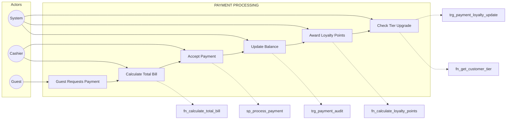

| Step | Actor | Action | Database Object |
|------|-------|--------|-----------------|
| 1 | Guest | Requests to pay | - |
| 2 | Cashier | Calculates total bill | `fn_calculate_total_bill` |
| 3 | Cashier | Accepts payment | `sp_process_payment` |
| 4 | System | Updates reservation balance | `trg_payment_audit` |
| 5 | System | Awards loyalty points | `fn_calculate_loyalty_points` |
| 6 | System | Checks/applies tier upgrade | `trg_payment_loyalty_update`, `fn_get_customer_tier` |

---

### Process 2: Invoice Generation

**Context:** A guest checks out and needs a detailed invoice. This process generates a comprehensive bill with all charges.

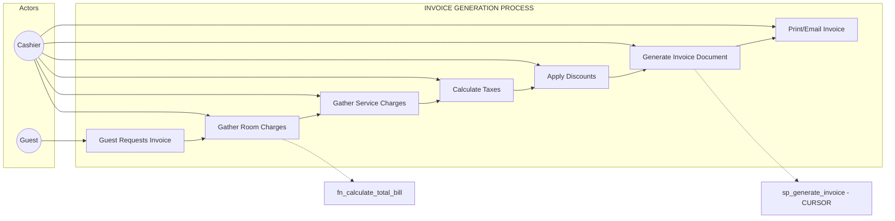

| Step | Actor | Action | Database Object |
|------|-------|--------|-----------------|
| 1 | Guest | Requests invoice | - |
| 2-5 | Cashier | Compiles all charges | `fn_calculate_total_bill` |
| 6 | Cashier | Generates invoice (uses cursor) | `sp_generate_invoice` (has CURSOR) |
| 7 | Cashier | Delivers invoice | - |

---

### Process 3: Accounts Receivable Management

**Context:** Finance team needs to track outstanding payments and send reminders to guests with unpaid balances.

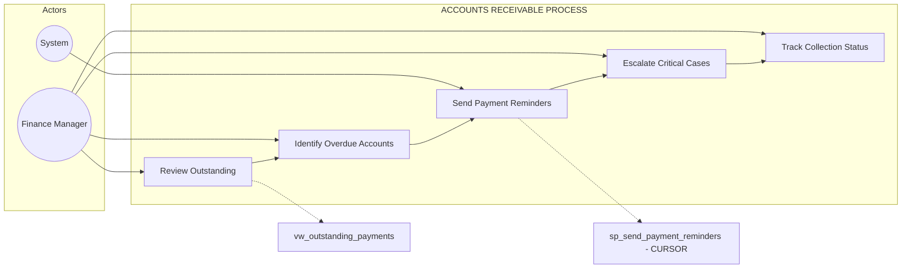

| Step | Actor | Action | Database Object |
|------|-------|--------|-----------------|
| 1 | Finance Manager | Reviews outstanding balances | `vw_outstanding_payments` |
| 2 | Finance Manager | Identifies overdue accounts | `vw_outstanding_payments` |
| 3 | System | Sends reminders in batch | `sp_send_payment_reminders` (CURSOR) |
| 4 | Finance Manager | Escalates critical cases | - |
| 5 | Finance Manager | Tracks status | `vw_outstanding_payments` |

---

### Process 4: Financial Reporting

**Context:** Management needs regular financial reports to understand revenue trends and make decisions.

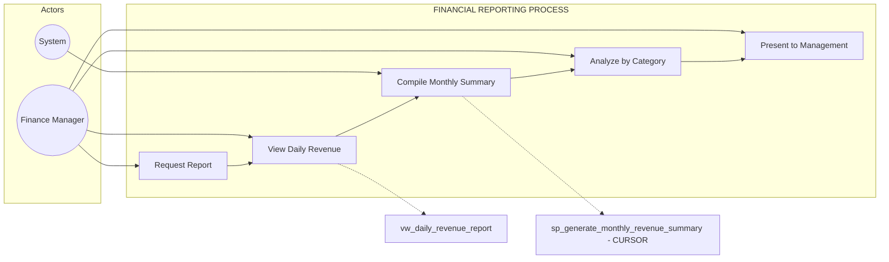

| Step | Actor | Action | Database Object |
|------|-------|--------|-----------------|
| 1 | Finance Manager | Requests report | - |
| 2 | Finance Manager | Views daily breakdown | `vw_daily_revenue_report` |
| 3 | System | Compiles monthly summary | `sp_generate_monthly_revenue_summary` (CURSOR) |
| 4 | Finance Manager | Analyzes trends | `vw_daily_revenue_report` |
| 5 | Finance Manager | Presents findings | - |

---

### Khanh's Complete Object Summary

| Type | Object | Process Used In |
|------|--------|-----------------|
| Procedure | `sp_process_payment` | Payment Processing |
| Procedure | `sp_generate_invoice` | Invoice Generation (has cursor) |
| **Cursor** | `sp_send_payment_reminders` | Accounts Receivable |
| **Cursor** | `sp_generate_monthly_revenue_summary` | Financial Reporting |
| View | `vw_daily_revenue_report` | Financial Reporting |
| View | `vw_outstanding_payments` | Accounts Receivable |
| Trigger | `trg_payment_loyalty_update` | Payment Processing |
| Trigger | `trg_payment_audit` | Payment Processing |
| Function | `fn_calculate_total_bill` | Payment, Invoice |
| Function | `fn_calculate_loyalty_points` | Payment Processing |
| Function | `fn_get_customer_tier` | Payment Processing |

---

# Ninh: Customer & Service Management

## Business Context
Ninh is responsible for the **Customer & Service Management** domain. This includes customer registration, managing hotel services, processing service requests, and maintaining customer loyalty programs.

---

### Process 1: Customer Registration

**Context:** A new guest needs to be registered in the system with their details and enrolled in the loyalty program.

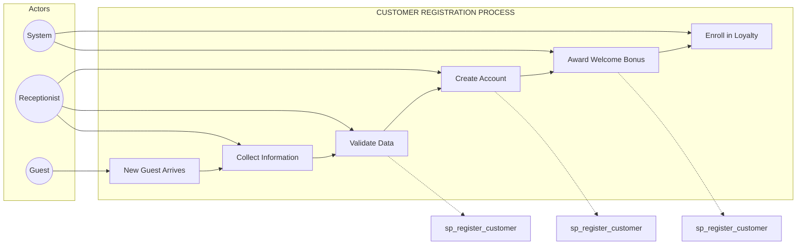

| Step | Actor | Action | Database Object |
|------|-------|--------|-----------------|
| 1 | Guest | Arrives as new customer | - |
| 2 | Receptionist | Collects personal info | - |
| 3 | Receptionist | Validates data | `sp_register_customer` |
| 4 | Receptionist | Creates account | `sp_register_customer` |
| 5 | System | Awards welcome bonus points | `sp_register_customer` |
| 6 | System | Enrolls in Bronze tier | `sp_register_customer` |

---

### Process 2: Service Request & Delivery

**Context:** A guest staying at the hotel requests a service (room service, spa, laundry, etc.). The service is delivered and charged to their room.

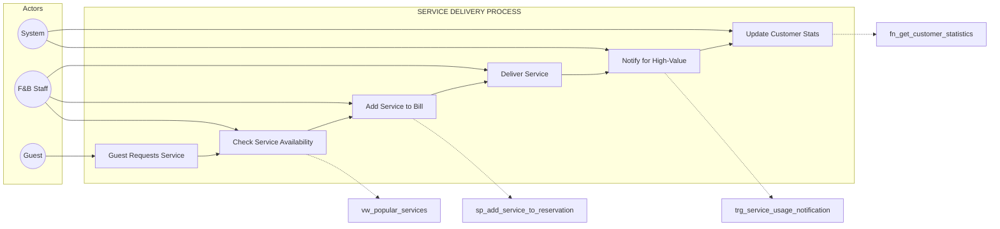

| Step | Actor | Action | Database Object |
|------|-------|--------|-----------------|
| 1 | Guest | Requests service | - |
| 2 | F&B Staff | Checks availability | `vw_popular_services` |
| 3 | F&B Staff | Adds to room bill | `sp_add_service_to_reservation` |
| 4 | F&B Staff | Delivers service | - |
| 5 | System | Alerts for high-value service | `trg_service_usage_notification` |
| 6 | System | Updates customer statistics | `fn_get_customer_statistics` |

---

### Process 3: Loyalty Tier Management

**Context:** Customers accumulate spending and need to be upgraded to higher loyalty tiers with better benefits.

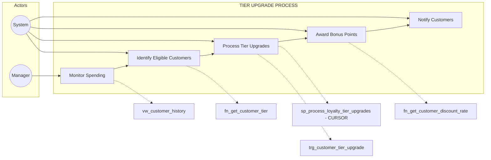

| Step | Actor | Action | Database Object |
|------|-------|--------|-----------------|
| 1 | Manager | Monitors customer spending | `vw_customer_history` |
| 2 | System | Identifies upgrade-eligible | `fn_get_customer_tier` |
| 3 | System | Processes upgrades in batch | `sp_process_loyalty_tier_upgrades` (CURSOR), `trg_customer_tier_upgrade` |
| 4 | System | Awards tier bonus points | `sp_process_loyalty_tier_upgrades` |
| 5 | System | Sends upgrade notification | `sp_process_loyalty_tier_upgrades` |

---

### Process 4: Service Analytics & Reporting

**Context:** Management needs to analyze service usage patterns to make business decisions about offerings and pricing.

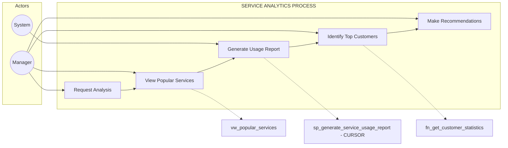

| Step | Actor | Action | Database Object |
|------|-------|--------|-----------------|
| 1 | Manager | Requests service analysis | - |
| 2 | Manager | Views popular services | `vw_popular_services` |
| 3 | System | Generates detailed report | `sp_generate_service_usage_report` (CURSOR) |
| 4 | Manager | Identifies top spending customers | `fn_get_customer_statistics` |
| 5 | Manager | Makes business recommendations | - |

---

### Ninh's Complete Object Summary

| Type | Object | Process Used In |
|------|--------|-----------------|
| Procedure | `sp_register_customer` | Customer Registration |
| Procedure | `sp_add_service_to_reservation` | Service Delivery |
| **Cursor** | `sp_process_loyalty_tier_upgrades` | Tier Management |
| **Cursor** | `sp_generate_service_usage_report` | Service Analytics |
| View | `vw_customer_history` | Tier Management |
| View | `vw_popular_services` | Service Delivery, Analytics |
| Trigger | `trg_customer_tier_upgrade` | Tier Management |
| Trigger | `trg_service_usage_notification` | Service Delivery |
| Function | `fn_get_customer_tier` | Tier Management |
| Function | `fn_get_customer_discount_rate` | Tier Management |
| Function | `fn_get_customer_statistics` | Service Delivery, Analytics |

---

# Tung: Operations & HR Management

## Business Context
Tung is responsible for the **Operations & HR Management** domain. This includes maintenance request handling, room status tracking, employee performance monitoring, and shift scheduling.

---

### Process 1: Maintenance Request Handling

**Context:** A room issue is reported (by guest or staff). This process covers request creation, staff assignment, and issue resolution.

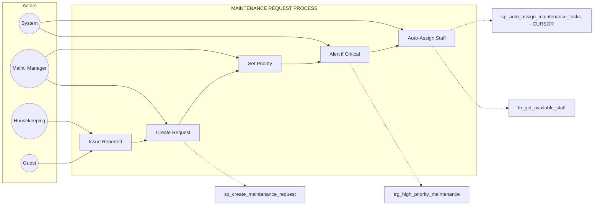

| Step | Actor | Action | Database Object |
|------|-------|--------|-----------------|
| 1 | Guest/Housekeeping | Reports issue | - |
| 2 | Maintenance Manager | Creates request | `sp_create_maintenance_request` |
| 3 | Maintenance Manager | Sets priority | `sp_create_maintenance_request` |
| 4 | System | Sends critical alert | `trg_high_priority_maintenance` |
| 5 | System | Auto-assigns to available staff | `sp_auto_assign_maintenance_tasks` (CURSOR), `fn_get_available_staff` |

---

### Process 2: Maintenance Completion & Room Status

**Context:** Maintenance staff completes a task. This process covers work completion, room status updates, and metric tracking.

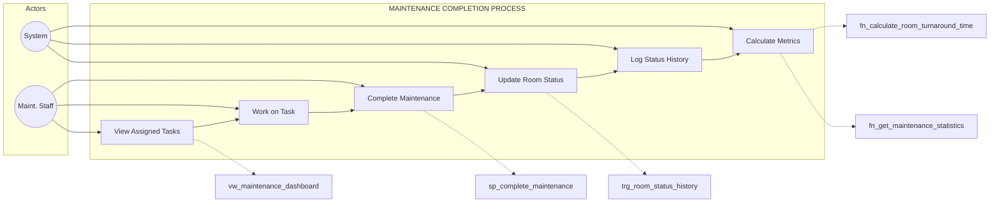

| Step | Actor | Action | Database Object |
|------|-------|--------|-----------------|
| 1 | Maintenance Staff | Views assigned tasks | `vw_maintenance_dashboard` |
| 2 | Maintenance Staff | Works on task | - |
| 3 | Maintenance Staff | Marks complete | `sp_complete_maintenance` |
| 4 | System | Updates room status | `sp_complete_maintenance` |
| 5 | System | Logs status change | `trg_room_status_history` |
| 6 | System | Calculates response metrics | `fn_calculate_room_turnaround_time`, `fn_get_maintenance_statistics` |

---

### Process 3: Employee Performance Monitoring

**Context:** Management needs to track employee performance, workload, and attendance to ensure operational efficiency.

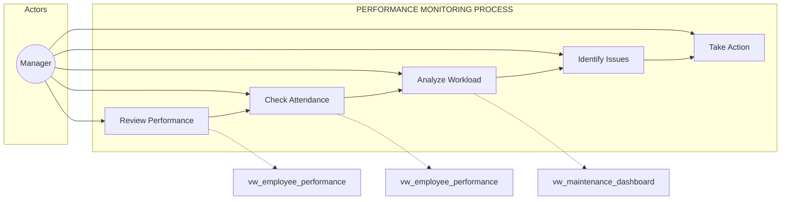

| Step | Actor | Action | Database Object |
|------|-------|--------|-----------------|
| 1 | Manager | Reviews performance ratings | `vw_employee_performance` |
| 2 | Manager | Checks attendance rates | `vw_employee_performance` |
| 3 | Manager | Analyzes current workload | `vw_maintenance_dashboard` |
| 4 | Manager | Identifies underperformers | `vw_employee_performance` |
| 5 | Manager | Takes corrective action | - |

---

### Process 4: Employee Shift Scheduling

**Context:** HR needs to generate and manage weekly shift schedules for all hotel staff across departments.

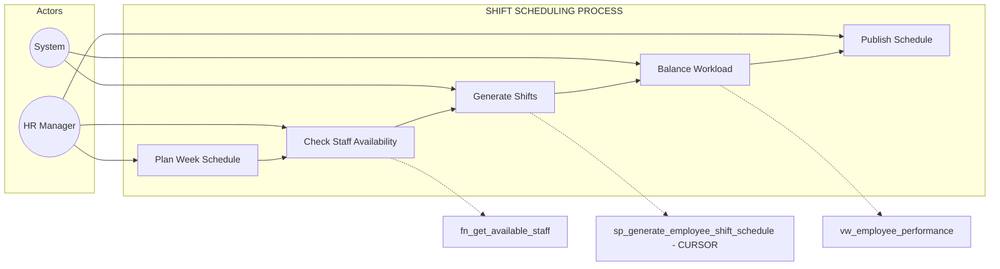

| Step | Actor | Action | Database Object |
|------|-------|--------|-----------------|
| 1 | HR Manager | Plans weekly schedule | - |
| 2 | HR Manager | Checks availability | `fn_get_available_staff` |
| 3 | System | Generates shifts in batch | `sp_generate_employee_shift_schedule` (CURSOR) |
| 4 | System | Balances workload by dept | `vw_employee_performance` |
| 5 | HR Manager | Publishes schedule | - |

---

### Tung's Complete Object Summary

| Type | Object | Process Used In |
|------|--------|-----------------|
| Procedure | `sp_create_maintenance_request` | Maintenance Request |
| Procedure | `sp_complete_maintenance` | Maintenance Completion |
| **Cursor** | `sp_auto_assign_maintenance_tasks` | Maintenance Request |
| **Cursor** | `sp_generate_employee_shift_schedule` | Shift Scheduling |
| View | `vw_maintenance_dashboard` | Request, Completion, Performance |
| View | `vw_employee_performance` | Performance, Scheduling |
| Trigger | `trg_room_status_history` | Maintenance Completion |
| Trigger | `trg_high_priority_maintenance` | Maintenance Request |
| Function | `fn_calculate_room_turnaround_time` | Maintenance Completion |
| Function | `fn_get_available_staff` | Request, Scheduling |
| Function | `fn_get_maintenance_statistics` | Maintenance Completion |

---

# Summary

## Processes per Member

| Member | Process 1 | Process 2 | Process 3 | Process 4 |
|--------|-----------|-----------|-----------|-----------|
| **Phuc** | Room Booking | Guest Check-In | Cancellation/No-Show | - |
| **Khanh** | Payment Processing | Invoice Generation | Accounts Receivable | Financial Reporting |
| **Ninh** | Customer Registration | Service Delivery | Tier Management | Service Analytics |
| **Tung** | Maintenance Request | Maintenance Completion | Performance Monitoring | Shift Scheduling |

## Objects per Member

| Member | Procedures | Cursors | Views | Triggers | Functions | Total |
|--------|------------|---------|-------|----------|-----------|-------|
| **Phuc** | 2 | 2 | 2 | 2 | 3 | 11 |
| **Khanh** | 2 (+cursor) | 2 | 2 | 2 | 3 | 11+ |
| **Ninh** | 2 | 2 | 2 | 2 | 3 | 11 |
| **Tung** | 2 | 2 | 2 | 2 | 3 | 11 |
| **TOTAL** | 8 | 8 | 8 | 8 | 12 | 44 |

## Verification Checklist

- [x] Each member has **3-4 distinct business processes**
- [x] Each process is **comprehensive** with clear start and end
- [x] Each process has **defined actors** who perform actions
- [x] Each process shows **which database objects** are used
- [x] Objects are **reused across processes** within the same domain
- [x] Each member has exactly **2 cursor procedures**
- [x] All processes are **interconnected** within the member's domain
