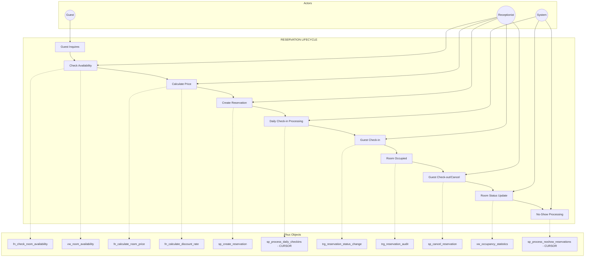
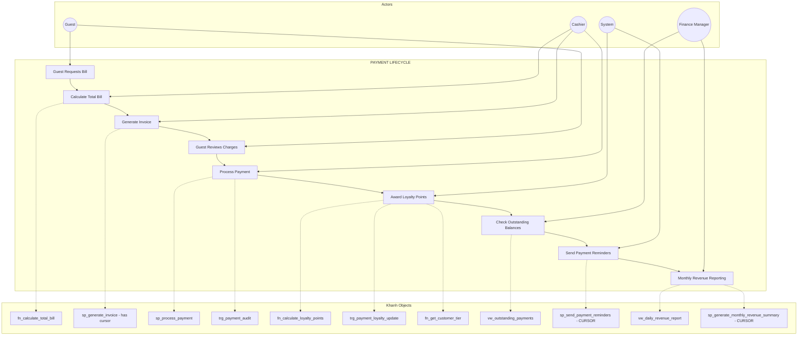
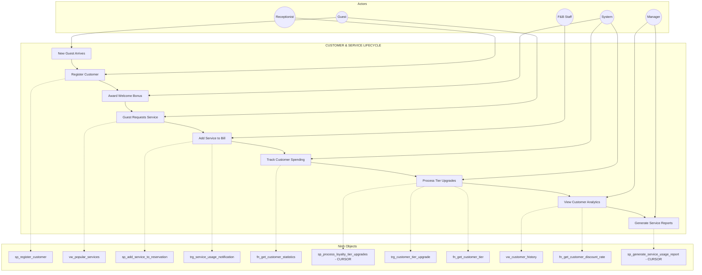
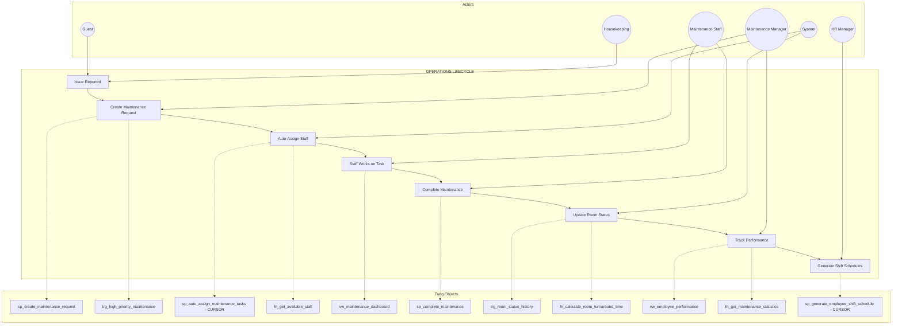

# Member Business Process Verification

This document verifies that each team member's SQL objects (procedures, views, triggers, functions, and cursors) form a **complete, cohesive business process** and are not disjointed.

---

## Phuc: Reservation & Room Management
### Business Process: Complete Reservation Lifecycle

### Actor-Action Mapping

| Actor | Actions | Database Objects Used |
|-------|---------|----------------------|
| **Guest** | Inquires about rooms, requests booking | - |
| **Receptionist** | Checks availability, calculates price, creates reservation, processes check-in/out | `sp_create_reservation`, `sp_cancel_reservation`, `vw_room_availability`, `fn_calculate_room_price` |
| **System (Automated)** | Daily check-in prep, room status updates, no-show processing | `sp_process_daily_checkins`, `sp_process_noshow_reservations`, `trg_reservation_status_change` |

### Objects Summary

| Type | Object Name | Actor | Role in Business Process |
|------|-------------|-------|-------------------------|
| **Procedure** | `sp_create_reservation` | Receptionist | Creates new booking with validation |
| **Procedure** | `sp_cancel_reservation` | Receptionist/Guest | Cancels booking with refund calculation |
| **Cursor** | `sp_process_daily_checkins` | System | Batch processes today's expected arrivals |
| **Cursor** | `sp_process_noshow_reservations` | System | Handles guests who didn't arrive |
| **View** | `vw_room_availability` | Receptionist | Shows real-time room status |
| **View** | `vw_occupancy_statistics` | Manager | Occupancy metrics and RevPAR |
| **Trigger** | `trg_reservation_status_change` | System | Auto-updates room status on check-in/out |
| **Trigger** | `trg_reservation_audit` | System | Logs all reservation changes |
| **Function** | `fn_check_room_availability` | Receptionist | Checks if room is available for dates |
| **Function** | `fn_calculate_room_price` | Receptionist | Calculates dynamic pricing |
| **Function** | `fn_calculate_discount_rate` | System | Applies membership discounts |

---

## Khanh: Payment & Financial Management
### Business Process: Complete Payment Lifecycle

### Actor-Action Mapping

| Actor | Actions | Database Objects Used |
|-------|---------|----------------------|
| **Guest** | Requests bill, reviews charges, makes payment | - |
| **Cashier** | Calculates bill, generates invoice, processes payment | `sp_generate_invoice`, `sp_process_payment`, `fn_calculate_total_bill` |
| **Finance Manager** | Reviews outstanding payments, views revenue reports | `vw_outstanding_payments`, `vw_daily_revenue_report` |
| **System (Automated)** | Awards loyalty points, sends reminders, generates reports | `sp_send_payment_reminders`, `sp_generate_monthly_revenue_summary`, `trg_payment_loyalty_update` |

### Objects Summary

| Type | Object Name | Actor | Role in Business Process |
|------|-------------|-------|-------------------------|
| **Procedure** | `sp_process_payment` | Cashier | Records payment, updates balance, awards points |
| **Procedure** | `sp_generate_invoice` | Cashier | Generates detailed invoice (uses cursor) |
| **Cursor** | `sp_send_payment_reminders` | System | Sends reminders for overdue payments |
| **Cursor** | `sp_generate_monthly_revenue_summary` | System/Manager | Compiles monthly financial report |
| **View** | `vw_daily_revenue_report` | Finance Manager | Daily revenue breakdown |
| **View** | `vw_outstanding_payments` | Finance Manager | Unpaid balances with aging |
| **Trigger** | `trg_payment_loyalty_update` | System | Auto-awards points and upgrades tiers |
| **Trigger** | `trg_payment_audit` | System | Logs all payment transactions |
| **Function** | `fn_calculate_total_bill` | Cashier | Calculates complete bill |
| **Function** | `fn_calculate_loyalty_points` | System | Points calculation logic |
| **Function** | `fn_get_customer_tier` | System | Determines tier by spending |

---

## Ninh: Customer & Service Management
### Business Process: Complete Customer & Service Lifecycle

### Actor-Action Mapping

| Actor | Actions | Database Objects Used |
|-------|---------|----------------------|
| **Guest** | Arrives, requests services | - |
| **Receptionist** | Registers new customer | `sp_register_customer` |
| **F&B Staff** | Adds services to bill | `sp_add_service_to_reservation` |
| **Manager** | Views analytics, generates reports | `vw_customer_history`, `vw_popular_services`, `sp_generate_service_usage_report` |
| **System (Automated)** | Awards bonus, tracks spending, upgrades tiers | `sp_process_loyalty_tier_upgrades`, `trg_customer_tier_upgrade`, `trg_service_usage_notification` |

### Objects Summary

| Type | Object Name | Actor | Role in Business Process |
|------|-------------|-------|-------------------------|
| **Procedure** | `sp_register_customer` | Receptionist | Creates new customer with welcome bonus |
| **Procedure** | `sp_add_service_to_reservation` | F&B Staff | Adds services to guest bill |
| **Cursor** | `sp_process_loyalty_tier_upgrades` | System | Batch upgrades eligible customers |
| **Cursor** | `sp_generate_service_usage_report` | Manager | Analyzes service usage patterns |
| **View** | `vw_customer_history` | Manager/Receptionist | Complete customer profile |
| **View** | `vw_popular_services` | Manager | Service usage and revenue analysis |
| **Trigger** | `trg_customer_tier_upgrade` | System | Auto-upgrades tiers on spending |
| **Trigger** | `trg_service_usage_notification` | System | Alerts for high-value services |
| **Function** | `fn_get_customer_tier` | System | Determines tier level |
| **Function** | `fn_get_customer_discount_rate` | System | Calculates customer discounts |
| **Function** | `fn_get_customer_statistics` | Manager | Returns customer metrics |

---

## Tung: Operations & HR Management
### Business Process: Complete Operations Lifecycle

### Actor-Action Mapping

| Actor | Actions | Database Objects Used |
|-------|---------|----------------------|
| **Guest** | Reports room issues | - |
| **Housekeeping** | Reports issues found during cleaning | - |
| **Maintenance Staff** | Works on tasks, completes maintenance | `sp_complete_maintenance`, `vw_maintenance_dashboard` |
| **Maintenance Manager** | Creates requests, monitors SLA, views performance | `sp_create_maintenance_request`, `vw_maintenance_dashboard`, `vw_employee_performance` |
| **HR Manager** | Generates shift schedules | `sp_generate_employee_shift_schedule` |
| **System (Automated)** | Auto-assigns tasks, updates room status, tracks history | `sp_auto_assign_maintenance_tasks`, `trg_room_status_history`, `trg_high_priority_maintenance` |

### Objects Summary

| Type | Object Name | Actor | Role in Business Process |
|------|-------------|-------|-------------------------|
| **Procedure** | `sp_create_maintenance_request` | Maintenance Manager | Creates request with auto-assignment |
| **Procedure** | `sp_complete_maintenance` | Maintenance Staff | Completes task, updates room |
| **Cursor** | `sp_auto_assign_maintenance_tasks` | System | Auto-assigns tasks to available staff |
| **Cursor** | `sp_generate_employee_shift_schedule` | HR Manager | Generates weekly shift schedules |
| **View** | `vw_maintenance_dashboard` | Maintenance Staff/Manager | SLA tracking and task overview |
| **View** | `vw_employee_performance` | Manager | Staff metrics and workload |
| **Trigger** | `trg_room_status_history` | System | Tracks all room status changes |
| **Trigger** | `trg_high_priority_maintenance` | System | Sends urgent alerts |
| **Function** | `fn_calculate_room_turnaround_time` | Manager | Measures cleaning efficiency |
| **Function** | `fn_get_available_staff` | System | Checks staff availability |
| **Function** | `fn_get_maintenance_statistics` | Manager | Returns maintenance metrics |

---

## Summary: Objects per Member

| Member | Procedures | Views | Triggers | Functions | Cursors | Total |
|--------|------------|-------|----------|-----------|---------|-------|
| **Phuc** | 2 | 2 | 2 | 3 | **2** | 11 |
| **Khanh** | 2 (+1 with cursor) | 2 | 2 | 3 | **2** | 11+ |
| **Ninh** | 2 | 2 | 2 | 3 | **2** | 11 |
| **Tung** | 2 | 2 | 2 | 3 | **2** | 11 |
| **TOTAL** | 8 | 8 | 8 | 12 | **8** | 44 |

---

## Actors Summary

| Actor | Member(s) | Main Interactions |
|-------|-----------|------------------|
| **Guest** | Phuc, Khanh, Ninh, Tung | Booking, payment, services, reporting issues |
| **Receptionist** | Phuc, Ninh | Check-in/out, registration, reservations |
| **Cashier** | Khanh | Payments, invoices, refunds |
| **F&B Staff** | Ninh | Service delivery, adding charges |
| **Housekeeping** | Tung | Reporting issues, room status |
| **Maintenance Staff** | Tung | Task completion, work orders |
| **Maintenance Manager** | Tung | Task creation, SLA monitoring |
| **Finance Manager** | Khanh | Revenue reports, outstanding payments |
| **HR Manager** | Tung | Shift scheduling, performance |
| **Manager (General)** | All | Analytics, dashboards, oversight |
| **System (Automated)** | All | Triggers, batch processing, notifications |

---

## Verification Checklist

- [x] Each member has exactly 2 cursor procedures
- [x] Each member's objects form a complete business process
- [x] Objects are not disjointed - they interconnect within the process
- [x] Actors are clearly identified for each action
- [x] Triggers support automatic actions in the workflow
- [x] Functions provide reusable calculations
- [x] Views provide monitoring and reporting
- [x] Cursors handle batch processing and complex reports
