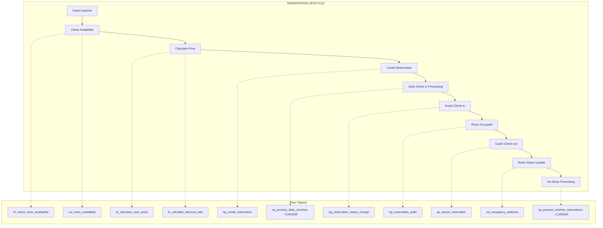
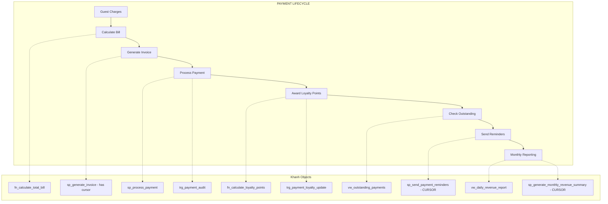
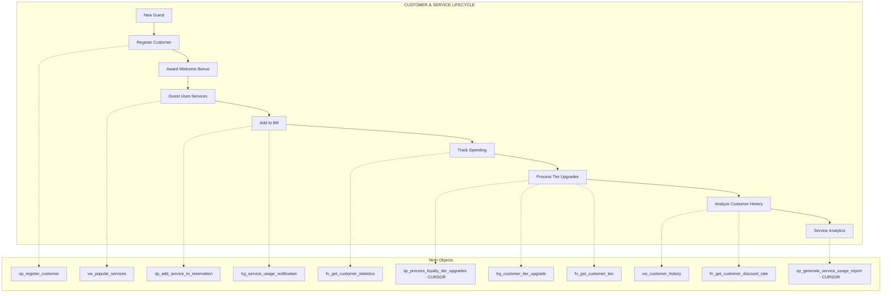
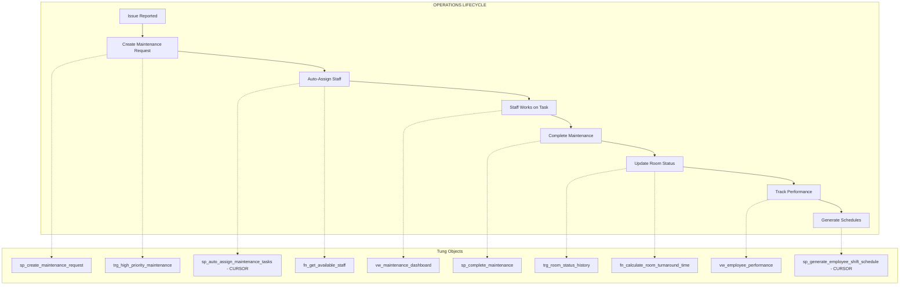

# Member Business Process Verification

This document verifies that each team member's SQL objects (procedures, views, triggers, functions, and cursors) form a **complete, cohesive business process** and are not disjointed.

---

## Phuc: Reservation & Room Management
### Business Process: Complete Reservation Lifecycle

### Objects Summary

| Type | Object Name | Role in Business Process |
|------|-------------|-------------------------|
| **Procedure** | `sp_create_reservation` | Creates new booking with validation |
| **Procedure** | `sp_cancel_reservation` | Cancels booking with refund calculation |
| **Cursor** | `sp_process_daily_checkins` | Batch processes today's expected arrivals |
| **Cursor** | `sp_process_noshow_reservations` | Handles guests who didn't arrive |
| **View** | `vw_room_availability` | Shows real-time room status |
| **View** | `vw_occupancy_statistics` | Occupancy metrics and RevPAR |
| **Trigger** | `trg_reservation_status_change` | Auto-updates room status on check-in/out |
| **Trigger** | `trg_reservation_audit` | Logs all reservation changes |
| **Function** | `fn_check_room_availability` | Checks if room is available for dates |
| **Function** | `fn_calculate_room_price` | Calculates dynamic pricing |
| **Function** | `fn_calculate_discount_rate` | Applies membership discounts |

### Process Flow Verification ✓
1. **Inquiry** → Uses `fn_check_room_availability` and `vw_room_availability`
2. **Pricing** → Uses `fn_calculate_room_price` and `fn_calculate_discount_rate`
3. **Booking** → Uses `sp_create_reservation` → Triggers `trg_reservation_audit`
4. **Daily Prep** → Uses `sp_process_daily_checkins` (CURSOR)
5. **Check-in** → Triggers `trg_reservation_status_change`
6. **Monitoring** → Uses `vw_occupancy_statistics`
7. **Cancellation** → Uses `sp_cancel_reservation`
8. **No-Show** → Uses `sp_process_noshow_reservations` (CURSOR)

---

## Khanh: Payment & Financial Management
### Business Process: Complete Payment Lifecycle

### Objects Summary

| Type | Object Name | Role in Business Process |
|------|-------------|-------------------------|
| **Procedure** | `sp_process_payment` | Records payment, updates balance, awards points |
| **Procedure** | `sp_generate_invoice` | Generates detailed invoice (uses cursor) |
| **Cursor** | `sp_send_payment_reminders` | Sends reminders for overdue payments |
| **Cursor** | `sp_generate_monthly_revenue_summary` | Compiles monthly financial report |
| **View** | `vw_daily_revenue_report` | Daily revenue breakdown |
| **View** | `vw_outstanding_payments` | Unpaid balances with aging |
| **Trigger** | `trg_payment_loyalty_update` | Auto-awards points and upgrades tiers |
| **Trigger** | `trg_payment_audit` | Logs all payment transactions |
| **Function** | `fn_calculate_total_bill` | Calculates complete bill |
| **Function** | `fn_calculate_loyalty_points` | Points calculation logic |
| **Function** | `fn_get_customer_tier` | Determines tier by spending |

### Process Flow Verification ✓
1. **Billing** → Uses `fn_calculate_total_bill`
2. **Invoicing** → Uses `sp_generate_invoice` (contains cursor)
3. **Payment** → Uses `sp_process_payment` → Triggers `trg_payment_audit`
4. **Loyalty** → Triggers `trg_payment_loyalty_update` → Uses `fn_calculate_loyalty_points`
5. **Monitoring** → Uses `vw_outstanding_payments` and `vw_daily_revenue_report`
6. **Collections** → Uses `sp_send_payment_reminders` (CURSOR)
7. **Reporting** → Uses `sp_generate_monthly_revenue_summary` (CURSOR)

---

## Ninh: Customer & Service Management
### Business Process: Complete Customer & Service Lifecycle

### Objects Summary

| Type | Object Name | Role in Business Process |
|------|-------------|-------------------------|
| **Procedure** | `sp_register_customer` | Creates new customer with welcome bonus |
| **Procedure** | `sp_add_service_to_reservation` | Adds services to guest bill |
| **Cursor** | `sp_process_loyalty_tier_upgrades` | Batch upgrades eligible customers |
| **Cursor** | `sp_generate_service_usage_report` | Analyzes service usage patterns |
| **View** | `vw_customer_history` | Complete customer profile |
| **View** | `vw_popular_services` | Service usage and revenue analysis |
| **Trigger** | `trg_customer_tier_upgrade` | Auto-upgrades tiers on spending |
| **Trigger** | `trg_service_usage_notification` | Alerts for high-value services |
| **Function** | `fn_get_customer_tier` | Determines tier level |
| **Function** | `fn_get_customer_discount_rate` | Calculates customer discounts |
| **Function** | `fn_get_customer_statistics` | Returns customer metrics |

### Process Flow Verification ✓
1. **Registration** → Uses `sp_register_customer`
2. **Service Request** → Uses `vw_popular_services` to check availability
3. **Service Usage** → Uses `sp_add_service_to_reservation` → Triggers `trg_service_usage_notification`
4. **Analytics** → Uses `fn_get_customer_statistics`
5. **Tier Upgrades** → Uses `sp_process_loyalty_tier_upgrades` (CURSOR) → Triggers `trg_customer_tier_upgrade`
6. **Customer Profile** → Uses `vw_customer_history` and `fn_get_customer_discount_rate`
7. **Service Reports** → Uses `sp_generate_service_usage_report` (CURSOR)

---

## Tung: Operations & HR Management
### Business Process: Complete Operations Lifecycle

### Objects Summary

| Type | Object Name | Role in Business Process |
|------|-------------|-------------------------|
| **Procedure** | `sp_create_maintenance_request` | Creates request with auto-assignment |
| **Procedure** | `sp_complete_maintenance` | Completes task, updates room |
| **Cursor** | `sp_auto_assign_maintenance_tasks` | Auto-assigns tasks to available staff |
| **Cursor** | `sp_generate_employee_shift_schedule` | Generates weekly shift schedules |
| **View** | `vw_maintenance_dashboard` | SLA tracking and task overview |
| **View** | `vw_employee_performance` | Staff metrics and workload |
| **Trigger** | `trg_room_status_history` | Tracks all room status changes |
| **Trigger** | `trg_high_priority_maintenance` | Sends urgent alerts |
| **Function** | `fn_calculate_room_turnaround_time` | Measures cleaning efficiency |
| **Function** | `fn_get_available_staff` | Checks staff availability |
| **Function** | `fn_get_maintenance_statistics` | Returns maintenance metrics |

### Process Flow Verification ✓
1. **Issue Report** → Uses `sp_create_maintenance_request` → Triggers `trg_high_priority_maintenance`
2. **Assignment** → Uses `sp_auto_assign_maintenance_tasks` (CURSOR) and `fn_get_available_staff`
3. **Monitoring** → Uses `vw_maintenance_dashboard`
4. **Completion** → Uses `sp_complete_maintenance` → Triggers `trg_room_status_history`
5. **Metrics** → Uses `fn_calculate_room_turnaround_time` and `fn_get_maintenance_statistics`
6. **HR** → Uses `vw_employee_performance` and `sp_generate_employee_shift_schedule` (CURSOR)

---

## Summary: Objects per Member

| Member | Procedures | Views | Triggers | Functions | Cursors | Total |
|--------|------------|-------|----------|-----------|---------|-------|
| **Phuc** | 2 | 2 | 2 | 3 | **2** | 11 |
| **Khanh** | 2 (+1 with cursor) | 2 | 2 | 3 | **2** | 11+ |
| **Ninh** | 2 | 2 | 2 | 3 | **2** | 11 |
| **Tung** | 2 | 2 | 2 | 3 | **2** | 11 |
| **TOTAL** | 8 | 8 | 8 | 12 | **8** | 44 |

---

## Verification Checklist

- [x] Each member has exactly 2 cursor procedures
- [x] Each member's objects form a complete business process
- [x] Objects are not disjointed - they interconnect within the process
- [x] Triggers support automatic actions in the workflow
- [x] Functions provide reusable calculations
- [x] Views provide monitoring and reporting
- [x] Cursors handle batch processing and complex reports
